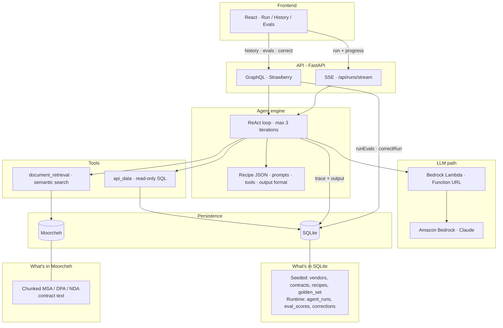

# Procurement Agent Platform

Composable procurement agents + eval harness, inspired by Zip's engineering posts:

- [The instructions are not the point](https://zip.com/engineering-blog/custom-agents-composable-ai-platform) - composable agents via recipe configs on one shared engine
- [Vibes Don't Ship: How We Evaluate Our AI Agents](https://zip.com/engineering-blog/vibes-dont-ship-how-we-evaluate-our-ai-agents) - deterministic checks, LLM-as-judge, and a correction loop into the golden set

Portfolio demo with Claude tool-use via Bedrock Lambda, Moorcheh retrieval, SQLite persistence, and a GraphQL/React UI.

**[Demo walkthrough video](https://drive.google.com/file/d/1uD8GfW4CJ8gEbp9sY0jZOUcWeE0KKWe-/view?usp=sharing)**

## Architecture

[View diagram on Figma](https://www.figma.com/board/rifVUyjwDfc8Vbhrw1f8PF/zip-procurement-agent-platform?node-id=0-1&t=YqSZlEguACNDzm0R-1)



| Layer | Stack | Role |
|---|---|---|
| Frontend | React, Apollo, Vite | Submit runs, stream progress, browse history, run evals |
| API | FastAPI, Strawberry GraphQL, SSE | GraphQL for app data; SSE streams agent progress while executing |
| Engine | Python recipe loader + ReAct loop | One engine for all agents - behavior comes from recipe JSON |
| LLM | Bedrock Lambda → Claude | Tool-use orchestration and eval judge calls |
| Tools | `api_data`, `document_retrieval` | SQL over vendors/contracts; semantic search over contract docs |
| Data | SQLite, Moorcheh | Structured procurement data + ingested document chunks |

- **Recipes** (`backend/recipes/*.json`) configure agents - the engine never branches on recipe name.
- **Eval** - `golden_set` → run recipe → score → `eval_scores`; correction closes the loop.

### Recipes

1. `duplicate_vendor_check` - policy: same domain + similar name → `block`; similar name **or** shared domain → `merge_review`; else `allow`.
2. `msa_risk_review` - retrieve contract text, flag liability / indemnity / renewal / privacy risks.

## Prerequisites

- Python 3.11+
- Node 20+
- AWS Bedrock Lambda backend deployed (see [`backend/aws`](backend/aws))
- Moorcheh on-prem at `http://localhost:8080` (you start it; app only calls the API)

## Setup

Deploy the AWS backend first (`cdk bootstrap` then `cdk deploy` in `backend/aws`), then set `BEDROCK_LAMBDA_URL` in `.env`.

```bash
# 1. Env
cp .env.example .env

# 2. Backend
cd backend
python -m pip install -r requirements.txt
python scripts/seed.py
python scripts/ingest.py          # requires Moorcheh up

# 3. API
uvicorn app.main:app --reload --app-dir .

# 4. Frontend (new terminal)
cd frontend
npm install
npm run dev
```

Open http://localhost:5173 - GraphQL playground at http://localhost:8000/graphql

## CLI demos

```bash
cd backend

python scripts/run_agent.py --recipe duplicate_vendor_check \
  --input "New vendor: Acme Corp LLC / acme.com"

python scripts/run_agent.py --recipe msa_risk_review \
  --input "Review MSA risk for CloudSync Analytics liability and auto-renewal"

python scripts/run_evals.py
python scripts/correct.py --run-id 1 --corrected-output '{"recommendation":"block"}'
```

## Demo walkthrough (5-7 min)

[Watch the demo video](https://drive.google.com/file/d/1uD8GfW4CJ8gEbp9sY0jZOUcWeE0KKWe-/view?usp=sharing)

1. Show two recipe JSON files - same engine fields, different prompts/tools.
2. Run Duplicate Vendor Check in the UI; expand the tool-call trace.
3. Run MSA Risk Review; show retrieval hits grounding the risks.
4. Run evals (UI button or `python scripts/run_evals.py`); refresh the Evals page.
5. Correct a run in the UI (or CLI); re-run evals and show the new golden row scoring.

## Tests

```bash
cd backend
pytest -q
```

## LLM path (Bedrock Lambda)

The app calls Claude through your Lambda Function URL (`BEDROCK_LAMBDA_URL`), which
streams from Amazon Bedrock. CDK stack: [`backend/aws`](backend/aws).
No Anthropic API key is required for the agent/judge path.
